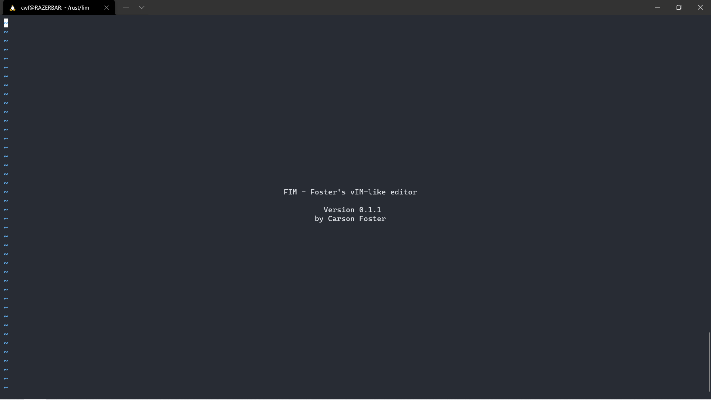
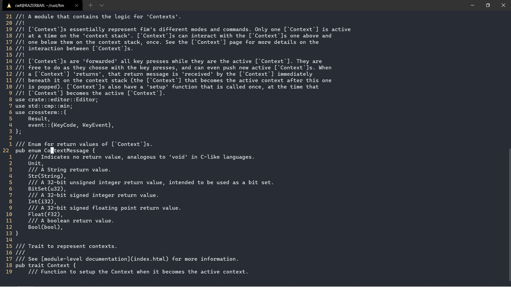

# fim
vim-like terminal text editor with support for multiple keyboard layouts (e.g. Dvorak, Colemak, user-defined layouts).

## Current Capabilities and Near-Future Plans
Most of the work on fim so far has been internal, architecture/structuring related, so fim can't do a whole lot quite yet, but it should grow pretty fast since the foundational systems are mostly done. A checked box means that feature is complete, while an unchecked box means that feature is on my todo list in the near future. As of right now, fim has:
- [x] a fleshed out, extensible [way](https://carsonfoster.github.io/fim/fim/context/index.html) of adding new capabilities
- [x] a finished CommandMode (where you enter commands after the ':' at the bottom of the screen)
  - [x] cursor movement and scrolling
  - [x] command history
  - [x] quitting the program (:q)
  - [ ] most common vim file commands (:o, :e, :w)
- [x] the ability to open and display files
  - [x] line numbers: relative (default), absolute, and none
  - [x] line wrapping fully implemented
- [x] the ability to read config files
  - [x] bind key combinations to Contexts (note that this is different than normal vim mapping, which maps key presses to other key presses)
  - [x] read options from the same config file
  - [x] include user-defined keyboard layouts
- [ ] common vim normal mode commands
  - [ ] basic movement
    - [x] left, up, down, right (hjkl)
- [x] built-in QWERTY, Dvorak, and Colemak layouts
  - [x] fully integrated with other fim systems
  - [x] way of reading user-defined layouts

# Documentation
See [here](https://carsonfoster.github.io/fim/) for fim's documentation, if you're curious about how fim is structured internally.
